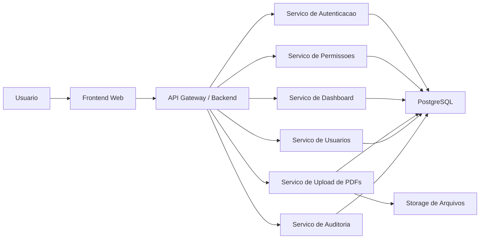
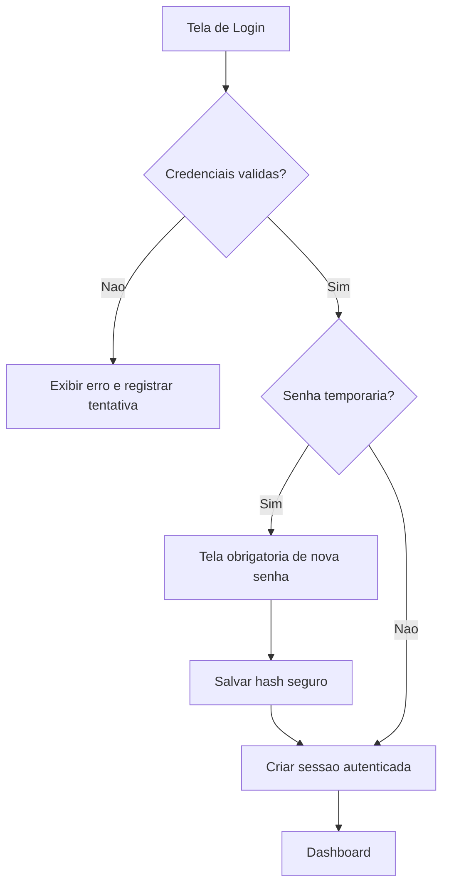
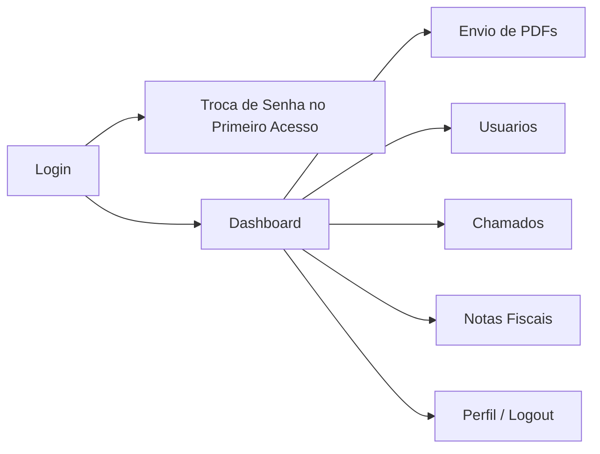
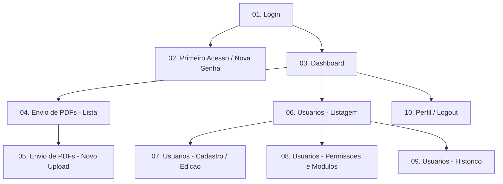
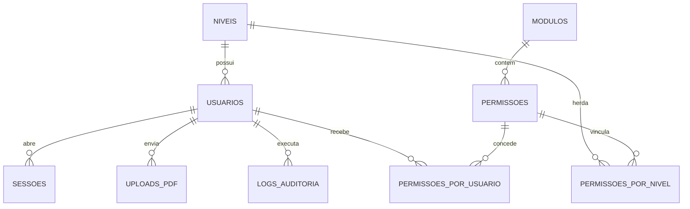

# Especificacao do Projeto - Portal Administrativo

## 1. Visao Geral

O Portal Administrativo sera uma aplicacao web corporativa para centralizar autenticacao, acompanhamento operacional, envio de documentos PDF, gestao de usuarios e controle granular de acesso por modulos. O sistema seguira identidade visual inspirada nas referencias anexadas: interface clara, corporativa, responsiva, com predominancia de azul, branco, cinza e destaques em vermelho institucional.

Objetivos principais:

- Centralizar operacoes administrativas em um unico portal.
- Garantir seguranca de acesso com autenticacao forte e trilha de auditoria.
- Permitir controle de acesso por nivel e por modulo individual.
- Disponibilizar dashboard executivo com indicadores e atividades recentes.
- Suportar crescimento futuro com novos modulos sem reestruturar a base.

## 2. Escopo Funcional

Modulos da primeira versao:

- Autenticacao e primeiro acesso.
- Dashboard inicial.
- Envio e gerenciamento de PDFs.
- Gestao de usuarios.
- Controle de modulos e permissoes.
- Logs e auditoria.

Modulos previstos na base de dados para evolucao:

- Chamados.
- Notas fiscais.
- Sessões e seguranca operacional.

## 3. Arquitetura do Sistema

Arquitetura sugerida: web em camadas com separacao entre apresentacao, API, dominio e persistencia.

Camadas:

- Frontend: SPA administrativa responsiva.
- Backend/API: API REST com autenticacao, regras de negocio e autorizacao RBAC.
- Persistencia: banco relacional para dados transacionais e auditoria.
- Storage: armazenamento de PDFs em disco estruturado ou bucket S3 compativel.
- Observabilidade: logs de aplicacao, logs de acesso e auditoria funcional.

## 4. Tecnologias Recomendadas

Frontend:

- React com Next.js ou React + Vite.
- TypeScript.
- Tailwind CSS ou shadcn/ui para composicao administrativa moderna.
- Recharts ou Apache ECharts para graficos.
- React Hook Form + Zod para formularios e validacao.

Backend:

- Node.js com NestJS.
- TypeScript.
- JWT com refresh token ou sessao server-side com cookies `httpOnly`.
- Prisma ORM ou TypeORM.
- Bcrypt ou Argon2 para hash de senha.

Banco de Dados:

- PostgreSQL.

Infraestrutura:

- Frontend em Vercel, Netlify ou Railway.
- Backend em Railway, Render, Fly.io ou VPS Dockerizada.
- Banco PostgreSQL gerenciado.
- Storage em S3, Cloudflare R2 ou equivalente.

## 5. Perfis de Acesso

Niveis nativos:

| Nivel | Perfil | Descricao |
|---|---|---|
| N1 | Usuario comum | Acesso basico aos modulos liberados |
| N2 | Financeiro ampliado | Acesso a todas as bases financeiras e modulos liberados |
| N3 | Administrador | Gerencia usuarios, senhas, bloqueios, modulos e acessa todos os modulos |
| N4 | Administrador Master | Controle total, incluindo configuracoes globais |

Usuarios iniciais:

| Nivel | Nome | E-mail |
|---|---|---|
| N4 | Dev. Adrian | adrian.ribeiro@alcepereirafilho.com.br |
| N4 | Dev. Wesley | wesleyalc.oliveira@gmail.com |
| N3 | Bruno Andre | bruno.andre@alcepereirafilho.com.br |
| N3 | Vinicius Paes | vinicius.paes@alcepereirafilho.com.br |
| N2 | Amanda Francisco | amanda.francisco@alcepereirafilho.com.br |
| N1 | Eder Nogueira | edernogueira.1987@gmail.com |
| N1 | Luka Moreno | lukaalcpereira@gmail.com |
| N1 | Isabela Alvarenga | isabelarp10@gmail.com |
| N1 | Larissa Sabrina | larissaalc7@gmail.com |
| N1 | Marcos Bueno | marcosbueno07@outlook.com |
| N1 | Joao Marcelo | jmsc14x14@gmail.com |

## 6. Modelo de Permissoes

O sistema usara RBAC com sobreposicao por usuario.

Regras:

- Todo usuario pertence a um nivel base.
- Cada nivel herda um conjunto padrao de permissoes.
- N3 e N4 podem conceder ou revogar modulos individualmente para qualquer usuario.
- Permissao individual sempre prevalece sobre a permissao padrao do nivel.
- Exclusao fisica de usuarios nao sera padrao; o comportamento preferencial sera desativacao logica.

Permissoes minimas por nivel:

| Modulo / Acao | N1 | N2 | N3 | N4 |
|---|---|---|---|---|
| Dashboard | Sim | Sim | Sim | Sim |
| Envio de PDFs | Sim | Sim | Sim | Sim |
| Visualizar bases financeiras | Nao | Sim | Sim | Sim |
| Gestao de usuarios | Nao | Nao | Sim | Sim |
| Liberar modulos | Nao | Nao | Sim | Sim |
| Configuracoes globais | Nao | Nao | Nao | Sim |
| Logs completos | Nao | Nao | Sim | Sim |

## 7. Fluxo de Autenticacao

Regras de login:

- Usuario acessa com e-mail e senha.
- Todos os usuarios iniciam com senha padrao `0000`.
- Ao autenticar com senha padrao, o sistema redireciona obrigatoriamente para troca de senha.
- Enquanto a senha nao for alterada, nenhum outro modulo pode ser acessado.
- Nova senha sera armazenada com hash seguro usando Argon2 ou bcrypt.
- Login bloqueado para usuarios inativos ou bloqueados.

Medidas de seguranca:

- Hash de senha com salt.
- Politica minima de senha forte na troca inicial.
- Sessao com expiracao e revogacao.
- Cookies `httpOnly`, `secure` e `sameSite` quando aplicavel.
- Protecao CSRF para operacoes mutaveis.
- Sanitizacao contra XSS.
- Queries parametrizadas para evitar SQL Injection.
- Rate limit para login e redefinicao de senha.

## 8. Fluxo de Navegacao

Regras da navegacao:

- O dashboard abre automaticamente apos autenticacao valida.
- O menu lateral inicia recolhido.
- Ao aproximar o mouse, o menu expande automaticamente.
- O menu permanece aberto enquanto o cursor estiver sobre a area lateral.
- O usuario ve apenas modulos liberados ao seu perfil.

## 9. Diagrama de Telas

## 10. Wireframes Descritivos

### Tela 01 - Login

- Fundo claro com grande area visual inspirada na landing page anexada.
- Lado esquerdo com logo ALC, mensagem de boas-vindas e reforco institucional.
- Lado direito ou bloco central com card de login.
- Campos: E-mail, Senha e botao `Acessar`.
- Rodape discreto com assinatura institucional.
- Estados visuais: erro de autenticacao, carregamento, senha temporaria detectada.

### Tela 02 - Primeiro Acesso

- Card central com mensagem obrigatoria de seguranca.
- Campos: Nova senha, Confirmar nova senha.
- Indicador de forca da senha.
- Botao `Salvar e continuar`.
- Sem menu lateral e sem acesso a qualquer rota interna.

### Tela 03 - Dashboard

- Barra superior com notificacoes, avatar, nome do usuario e menu de perfil.
- Menu lateral retratil com logo, modulos e saida.
- Cards superiores com KPIs.
- Area central com grafico de desempenho.
- Coluna lateral ou painel com atividades recentes.
- Bloco de atalhos rapidos para `Enviar PDF` e `Cadastrar Usuario`.
- Layout muito proximo da referencia visual anexada, com bordas suaves, sombras leves e alto respiro entre componentes.

### Tela 04 - Envio de PDFs

- Botao principal `Novo upload`.
- Tabela com nome do arquivo, status, data de envio, usuario responsavel e acoes.
- Filtros por periodo, status e usuario.
- Acoes por item: visualizar, baixar, substituir, excluir.
- Substituicao e exclusao condicionadas a permissao.

### Tela 05 - Usuarios

- Tabela com nome, e-mail, nivel, status, ultimo acesso e acoes.
- Busca textual por nome ou e-mail.
- Filtros por nivel, status e modulo.
- Acoes: criar, editar, redefinir senha, bloquear, desbloquear, ativar, desativar, alterar nivel, liberar modulos, remover modulos, ver historico.

## 11. Regras de Negocio

Autenticacao:

- Nao permitir acesso de usuarios bloqueados ou inativos.
- Registrar sucesso e falha de login em auditoria.
- Exigir troca de senha no primeiro acesso.

Usuarios:

- E-mail deve ser unico.
- Usuario novo nasce com senha `0000`, status `ativo` e flag `primeiro_acesso = true`.
- N3 e N4 podem redefinir senha; ao redefinir, o sistema volta `primeiro_acesso = true`.
- Apenas N4 pode alterar configuracoes sensiveis globais.

Permissoes:

- O nivel define o conjunto base.
- Modulos adicionais podem ser liberados individualmente.
- Modulos removidos individualmente devem prevalecer sobre a heranca do nivel, se o modelo adotado incluir negacao explicita.

PDFs:

- Upload multiplo permitido.
- Cada arquivo deve possuir metadados de autor, data, status e versao.
- Ao substituir um PDF, manter historico da versao anterior.
- Exclusao idealmente logica para preservar rastreabilidade.

Dashboard:

- KPIs devem considerar filtros de periodo.
- Atividades recentes devem exibir usuario, acao, data e entidade afetada.

## 12. Estrutura do Banco de Dados

Tabelas principais:

### `niveis`

| Campo | Tipo | Regra |
|---|---|---|
| id | uuid | PK |
| codigo | varchar(10) | Unico: N1, N2, N3, N4 |
| nome | varchar(100) | Obrigatorio |
| descricao | text | Opcional |

### `usuarios`

| Campo | Tipo | Regra |
|---|---|---|
| id | uuid | PK |
| nome | varchar(150) | Obrigatorio |
| email | varchar(150) | Unico |
| senha_hash | text | Obrigatorio |
| nivel_id | uuid | FK `niveis.id` |
| ativo | boolean | Default true |
| bloqueado | boolean | Default false |
| primeiro_acesso | boolean | Default true |
| ultimo_login_em | timestamp | Opcional |
| criado_em | timestamp | Obrigatorio |
| atualizado_em | timestamp | Obrigatorio |

### `modulos`

| Campo | Tipo | Regra |
|---|---|---|
| id | uuid | PK |
| codigo | varchar(50) | Unico |
| nome | varchar(100) | Obrigatorio |
| descricao | text | Opcional |
| ativo | boolean | Default true |

### `permissoes`

| Campo | Tipo | Regra |
|---|---|---|
| id | uuid | PK |
| codigo | varchar(80) | Unico |
| nome | varchar(120) | Obrigatorio |
| modulo_id | uuid | FK `modulos.id` |

### `permissoes_por_nivel`

| Campo | Tipo | Regra |
|---|---|---|
| id | uuid | PK |
| nivel_id | uuid | FK `niveis.id` |
| permissao_id | uuid | FK `permissoes.id` |

### `permissoes_por_usuario`

| Campo | Tipo | Regra |
|---|---|---|
| id | uuid | PK |
| usuario_id | uuid | FK `usuarios.id` |
| permissao_id | uuid | FK `permissoes.id` |
| tipo | varchar(20) | `grant` ou `deny` |
| concedido_por | uuid | FK `usuarios.id` |
| criado_em | timestamp | Obrigatorio |

### `uploads_pdf`

| Campo | Tipo | Regra |
|---|---|---|
| id | uuid | PK |
| nome_arquivo | varchar(255) | Obrigatorio |
| nome_original | varchar(255) | Obrigatorio |
| caminho_arquivo | text | Obrigatorio |
| versao | integer | Default 1 |
| status | varchar(30) | `pendente`, `processado`, `erro`, `substituido` |
| usuario_id | uuid | FK `usuarios.id` |
| substitui_upload_id | uuid | FK auto-relacionada, opcional |
| criado_em | timestamp | Obrigatorio |

### `chamados`

| Campo | Tipo | Regra |
|---|---|---|
| id | uuid | PK |
| titulo | varchar(180) | Obrigatorio |
| descricao | text | Obrigatorio |
| status | varchar(30) | `aberto`, `aguardando`, `concluido` |
| solicitante_id | uuid | FK `usuarios.id` |
| responsavel_id | uuid | FK `usuarios.id`, opcional |
| criado_em | timestamp | Obrigatorio |

### `notas_fiscais`

| Campo | Tipo | Regra |
|---|---|---|
| id | uuid | PK |
| numero | varchar(60) | Obrigatorio |
| fornecedor | varchar(150) | Obrigatorio |
| valor | numeric(14,2) | Obrigatorio |
| status | varchar(30) | `pendente`, `aprovada`, `rejeitada` |
| criado_em | timestamp | Obrigatorio |

### `logs_auditoria`

| Campo | Tipo | Regra |
|---|---|---|
| id | uuid | PK |
| usuario_id | uuid | FK `usuarios.id`, opcional |
| acao | varchar(80) | Obrigatorio |
| entidade | varchar(80) | Obrigatorio |
| entidade_id | uuid | Opcional |
| detalhes | jsonb | Opcional |
| ip_origem | varchar(64) | Opcional |
| user_agent | text | Opcional |
| criado_em | timestamp | Obrigatorio |

### `sessoes`

| Campo | Tipo | Regra |
|---|---|---|
| id | uuid | PK |
| usuario_id | uuid | FK `usuarios.id` |
| token_hash | text | Obrigatorio |
| expira_em | timestamp | Obrigatorio |
| revogada_em | timestamp | Opcional |
| criado_em | timestamp | Obrigatorio |

Relacionamentos centrais:

## 13. Casos de Uso Principais

| Caso de uso | Ator | Resultado esperado |
|---|---|---|
| Realizar login | Todos | Entrar no sistema ou ser redirecionado para troca de senha |
| Alterar senha no primeiro acesso | Todos | Liberar acesso total apos definicao de senha segura |
| Visualizar dashboard | Usuarios permitidos | Ver indicadores e atividades conforme permissao |
| Enviar PDFs | Usuarios permitidos | Registrar arquivos e status no sistema |
| Substituir PDF | Usuarios com permissao especifica | Criar nova versao e manter historico |
| Gerenciar usuarios | N3 e N4 | Criar, editar, bloquear, redefinir senhas e ajustar modulos |
| Consultar auditoria | N3 e N4 | Rastrear eventos criticos do sistema |

## 14. Logs e Auditoria

Eventos obrigatorios:

- Login com sucesso.
- Falha de login.
- Logout.
- Alteracao de senha.
- Criacao e edicao de usuario.
- Bloqueio, desbloqueio, ativacao e desativacao.
- Alteracao de nivel.
- Concessao e remocao de modulos.
- Upload, substituicao e exclusao logica de PDFs.

Cada log deve registrar:

- Usuario executor.
- Acao realizada.
- Entidade afetada.
- Data e hora.
- IP de origem.
- Resumo do que mudou.

## 15. Diretrizes de Interface

Identidade visual:

- Base em branco e cinza muito claro.
- Azul corporativo como cor estrutural.
- Vermelho institucional como destaque de acao, alerta e identidade.
- Tipografia limpa e contemporanea.
- Cartoes com cantos suaves, sombras discretas e espacamento generoso.

Comportamento responsivo:

- Desktop como prioridade principal.
- Tablet com menu recolhivel por toque.
- Mobile com drawer lateral e cards empilhados.

Padrao de componentes:

- KPI cards.
- Tabelas administrativas com filtros.
- Graficos lineares e de barras.
- Timeline de atividades.
- Dialogos de confirmacao para acoes sensiveis.

## 16. Plano de Desenvolvimento por Fases

### Fase 1 - Fundacao

- Definicao da arquitetura.
- Setup do repositorio, ambiente e CI/CD.
- Modelagem inicial do banco.
- Implantacao da autenticacao e primeiro acesso.

### Fase 2 - Base Administrativa

- Dashboard inicial.
- Menu lateral retratil.
- Gestao de usuarios.
- RBAC por nivel e por usuario.

### Fase 3 - Operacao de Documentos

- Upload multiplo de PDFs.
- Listagem, filtros, download e substituicao por versao.
- Logs completos de operacao.

### Fase 4 - Modulos de Expansao

- Chamados.
- Notas fiscais.
- Relatorios gerenciais.

### Fase 5 - Robustez

- Monitoramento.
- Hardening de seguranca.
- Testes automatizados.
- Ajustes de performance e UX.

## 17. Funcionalidades Futuras Recomendadas

- Workflow de aprovacao para PDFs e notas fiscais.
- Assinatura digital de documentos.
- Notificacoes por e-mail e dentro do sistema.
- Exportacao de relatorios em PDF e Excel.
- Painel financeiro detalhado para N2+.
- Configurador de dashboard por perfil.
- Integração com ERP, CRM ou armazenamento externo.
- Autenticacao em dois fatores para N3 e N4.
- Trilhas de aprovacao por departamento.
- API publica interna para integracoes corporativas.

## 18. Conclusao Executiva

O Portal Administrativo deve nascer como uma plataforma modular, segura e escalavel. A combinacao de RBAC por nivel com permissoes individuais oferece flexibilidade operacional sem perder governanca. A referencia visual anexada ja define um caminho solido para uma interface corporativa moderna, com foco em clareza, produtividade e rastreabilidade.
